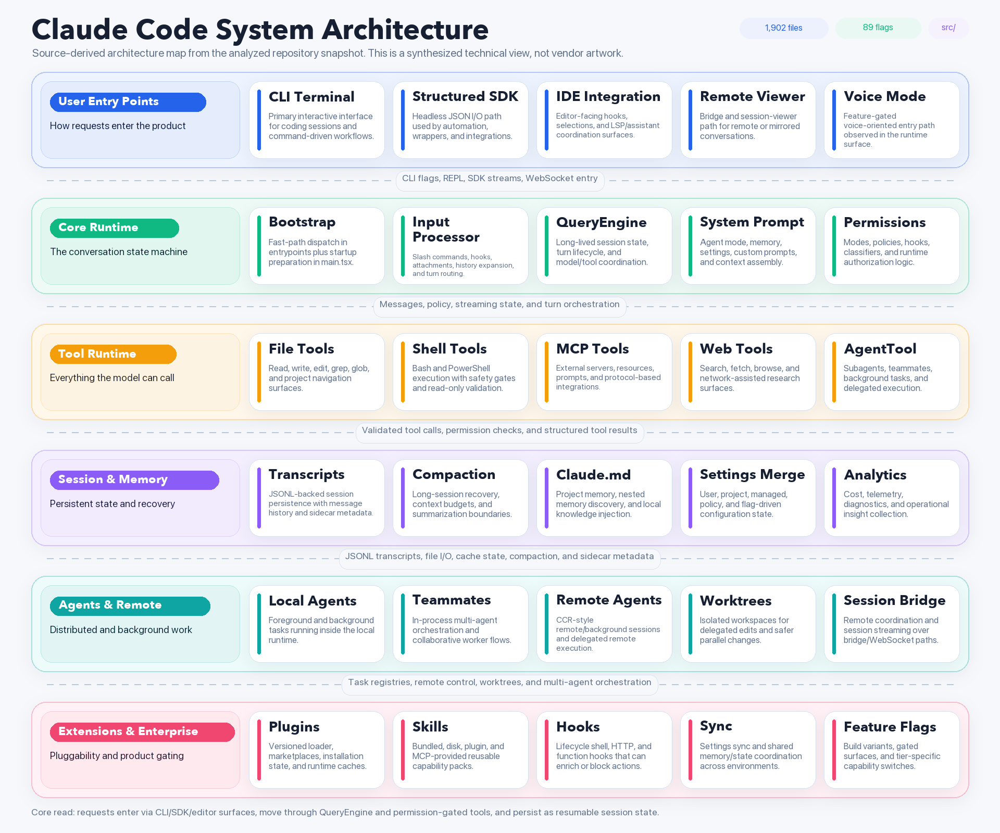
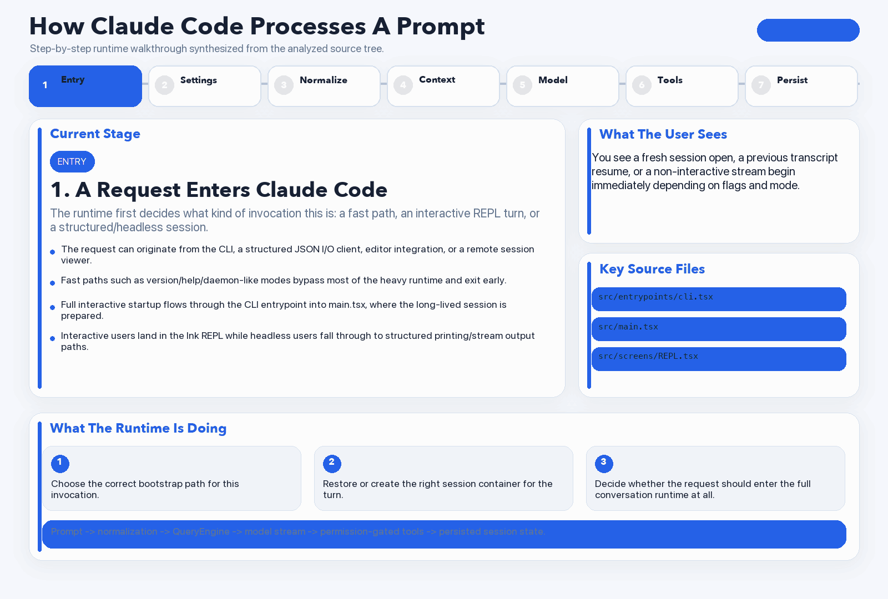

# Claude Code User Guide

This guide is based on the source analysis in this repository snapshot. It explains how Claude Code works, how to think about the system as a user, and how to use the major flows effectively.

To regenerate the visuals in this guide:

```bash
. .venv-assets/bin/activate
python scripts/generate_architecture_assets.py
```

## Visual Assets

### System Architecture



### Step-By-Step Workflow GIF



### Individual Workflow Frames

- [Step 1](docs/assets/claude-code-how-it-works-step-01.png)
- [Step 2](docs/assets/claude-code-how-it-works-step-02.png)
- [Step 3](docs/assets/claude-code-how-it-works-step-03.png)
- [Step 4](docs/assets/claude-code-how-it-works-step-04.png)
- [Step 5](docs/assets/claude-code-how-it-works-step-05.png)
- [Step 6](docs/assets/claude-code-how-it-works-step-06.png)
- [Step 7](docs/assets/claude-code-how-it-works-step-07.png)

## The Short Mental Model

Claude Code is best understood as a terminal-native agent runtime with six major layers:

1. Entry points
2. Core runtime
3. Tools
4. Session and memory
5. Agents and remote execution
6. Extensions and enterprise integrations

The key idea is:

- you do not talk directly to the model
- you talk to a runtime that prepares context, enforces permissions, executes tools, persists sessions, and optionally delegates work to other agents

That runtime is what makes Claude Code different from a simple chat window.

## What Happens When You Enter A Prompt

## 1. You enter a request

You can enter a request through several runtime surfaces:

- the interactive CLI / REPL
- a headless structured I/O / SDK flow
- an IDE-assisted surface
- a remote session viewer / bridge path
- feature-gated paths like voice mode

At this stage Claude Code decides whether your request is:

- a cheap fast-path command
- a slash command
- a normal model query
- a background or remote control action

## 2. Claude Code bootstraps the correct runtime

Before doing expensive work, the CLI entrypoint checks for fast paths such as:

- version output
- daemon and bridge modes
- MCP server mode
- background session operations
- other special boot modes

If your request needs the full runtime, `main.tsx` initializes:

- settings
- auth
- policy limits
- analytics
- skills
- plugins
- commands
- tools
- remote state
- session restore / resume state

What this means for users:

- startup behavior changes depending on flags and mode
- not every command pays the cost of the whole application
- some features can appear or disappear before the UI even starts

## 3. Settings, auth, and policy are resolved

Claude Code merges several settings sources before the assistant acts:

- user settings
- project settings
- local settings
- managed or policy settings
- flag-based settings
- remote-managed settings when eligible

It also checks:

- auth tokens
- organization limits
- remote/background eligibility
- plugin/MCP availability
- permission mode defaults

What this means for users:

- the same prompt can behave differently in different repos or orgs
- some tools or remote features may be disabled by policy
- permissions mode is a major part of the runtime, not an afterthought

## 4. Your input is normalized

Claude Code does not just send raw text to the model.

It first decides whether your input is:

- a slash command
- a plain text prompt
- a prompt with attachments
- a prompt with pasted references
- a prompt that should trigger hooks

This stage can add:

- images or document attachments
- IDE context
- history expansions
- hook-provided context
- command-generated system messages

What this means for users:

- slash commands are usually handled before the model sees anything
- attachments and pasted references are treated as structured input
- hooks can enrich, block, or stop a turn before it queries the model

## 5. QueryEngine builds the turn

Once Claude Code decides this should be a real model turn, `QueryEngine` prepares:

- the current message history
- the system prompt
- the effective tool list
- memory and attachments
- model selection
- token budgets
- session-scoped state

This is where the runtime decides what context the model actually gets.

What this means for users:

- the visible transcript is only part of the model context story
- system prompt, memory files, and attachments matter a lot
- large sessions are managed actively, not passively

## 6. The model streams a response

The API layer sends the normalized request to the model and streams back:

- text
- thinking-related blocks
- structured output
- tool calls

If the model wants to use tools, Claude Code captures those tool requests and moves to the execution stage.

What this means for users:

- the assistant can pivot from text into tools mid-turn
- a single turn can contain multiple rounds of model output and tool execution
- if the context is too large, Claude Code may compact or recover the session instead of simply failing

## 7. Tools execute under runtime control

Tool calls do not run directly. They go through:

- input validation
- permission checks
- hooks
- batching/orchestration
- telemetry
- result transformation

The runtime can execute:

- file tools
- shell tools
- MCP tools
- web tools
- agent-spawning tools
- other built-ins

What this means for users:

- permission prompts are a core product behavior
- shell tools are deliberately constrained
- tool runs can be concurrent when safe, serialized when not safe

## 8. Results are turned back into conversation state

Tool outputs are transformed into model-visible messages and fed back into the next tool round or the next assistant response.

At the same time Claude Code updates:

- session transcript files
- tool progress state
- task state
- agent state
- notifications
- usage/cost counters

What this means for users:

- a turn can continue across multiple tool rounds
- background agents can finish later and notify the main session
- long-lived sessions are first-class, not accidental

## 9. The turn either ends, compacts, or continues

When enough context accumulates, Claude Code can compact history while preserving important artifacts such as:

- summaries of earlier work
- selected files
- memory content
- skill instructions
- critical boundaries in the conversation

What this means for users:

- very long sessions can stay usable
- resume works because the session is persisted explicitly
- the runtime is actively managing context, not just appending forever

## How To Use Claude Code Effectively

## 1. Start with the right task shape

Claude Code works best when your request includes:

- the goal
- the repository or area of code to inspect
- constraints
- the expected output

Good examples:

- “Review the auth changes in `src/services/api` for regressions.”
- “Trace how plugin settings are loaded and summarize the precedence order.”
- “Refactor the tool batching logic without changing runtime behavior.”

Less effective examples:

- “Fix it.”
- “Make this better.”
- “What’s wrong?”

Why:

- the runtime can search and read for you, but clarity still matters
- better prompts reduce wasted tool use and reduce permission churn

## 2. Decide whether this is a direct request, a command, or a delegated task

Use a direct prompt when:

- you want analysis or implementation in the current thread
- you want the assistant to choose tools normally

Use slash commands when:

- a built-in operation already exists
- you want a known runtime action such as configuration, model changes, review, permissions, memory, plugin, or MCP management

Use agent delegation when:

- the work is parallelizable
- one sub-task can proceed independently
- you want background progress while you continue other work

Do not delegate everything by default.

Why:

- subagents increase orchestration complexity
- local context is often best handled by the main thread unless the work is clearly separable

## 3. Be deliberate about permissions

Claude Code’s permission system is central to the product. Before big tasks, understand:

- whether you are in default, auto, or another permission mode
- whether shell access will be needed
- whether remote/background execution is allowed

Practical advice:

- keep high-risk shell work explicit
- prefer file reads and search before broad shell commands
- use stricter modes when exploring unfamiliar repos
- loosen permissions only when you understand the tradeoff

Why:

- the runtime treats shell and tool execution as security-sensitive
- many capabilities are intentionally gated rather than auto-approved

## 4. Use the system in the order it wants to work

For most technical tasks, the effective order is:

1. Clarify the goal.
2. Let Claude Code inspect the relevant files.
3. Let it summarize what it found.
4. Ask for the change or review.
5. Verify the result.

This matches the actual code flow:

- input normalization
- context assembly
- file/search tools
- model reasoning
- edits or review output

## 5. For large work, separate planning and execution

Claude Code has strong support for:

- plan-oriented flows
- multi-step tasks
- agent delegation
- background work

For large changes:

1. Ask for a plan first.
2. Confirm the architecture and files involved.
3. Execute in bounded slices.
4. Review and verify after each slice.

Why:

- the runtime persists long sessions well, but smaller milestones are still easier to validate
- large unbounded requests tend to create unnecessary tool churn

## 6. Use agents only when the work is genuinely separable

Agent-based work is useful for:

- independent research subtasks
- isolated implementation chunks
- worktree-isolated experiments
- long-running background operations

It is not useful when:

- the next decision depends immediately on the result
- the work is so small that orchestration dominates
- the repo area is too intertwined for safe independent changes

Practical rule:

- delegate sidecars, not the critical path

## 7. Treat remote/background work as a special mode

The source shows remote/background tasks have real prerequisites, including checks around:

- login state
- git repository state
- git remote presence
- GitHub app / remote environment availability
- organization policy

Use remote/background flows when:

- the task may take a while
- you want work to continue while you do something else
- you want a separate remote execution context

Do not assume they are always available.

## 8. Understand what persists

Claude Code is built around explicit persistence:

- transcripts
- task metadata
- remote agent metadata
- worktree state
- memory and settings state

This means you should think in terms of sessions, not one-off chats.

Good habits:

- resume existing work instead of restarting the same conversation repeatedly
- use memory/features intentionally when a repo has stable context
- expect the runtime to preserve useful state across longer engagements

## 9. Know what extension surface you are activating

Claude Code can be extended through:

- plugins
- marketplaces
- MCP servers
- skills
- hooks

Treat these as powerful runtime extensions, not cosmetic add-ons.

Practical advice:

- only enable trusted plugins and MCP servers
- understand that hooks can alter runtime behavior
- remember that org policy may restrict or override these features

## Detailed User Workflows

## Workflow A: Normal interactive coding session

1. Open Claude Code in the repo you want to work in.
2. Confirm the working directory and repo are correct.
3. Make sure the desired permission mode is active.
4. Give a precise first prompt describing the task and affected files or subsystem.
5. Let Claude Code inspect the code before pushing for edits.
6. Review the assistant’s understanding of the architecture.
7. Ask for implementation or review once the scope is clear.
8. Watch for permission prompts, tool progress, or background task indicators.
9. Ask for verification or follow-up fixes as needed.
10. Resume the same session later if the work continues.

## Workflow B: Code review / analysis session

1. State that you want review findings first.
2. Point the assistant to the specific files, diff area, or subsystem.
3. Ask for ordered severity and behavioral regressions, not a summary first.
4. Let Claude Code read the code and supporting modules.
5. Review the findings.
6. Ask for fixes only after the findings are clear.

Why this works:

- the codebase already has review-oriented command surfaces and structured tool use
- analysis-first requests align well with the runtime

## Workflow C: Large refactor or architectural change

1. Ask for a scoped plan.
2. Confirm the boundaries and risks.
3. Decide whether to split the work into multiple prompts or subagents.
4. Let Claude Code edit in small slices.
5. Ask for validation after each slice.
6. Keep the session alive so the transcript and context keep compounding.

## Workflow D: Agent delegation / parallel work

1. Identify the part that can run independently.
2. Give the main thread the critical-path work.
3. Delegate only the bounded side task.
4. Continue local work while the delegated task runs.
5. Review the returned result before integrating it.

Examples:

- one agent maps plugin loading while the main thread studies permission flow
- one agent fixes a self-contained UI panel while the main thread works on the backend service

## Workflow E: Remote/background task

1. Confirm you are logged in.
2. Confirm the repo is in a valid git state.
3. Confirm the remote/background feature is allowed in your environment.
4. Launch the remote/background task only when it is worth the setup cost.
5. Watch the task progress and notifications.
6. Resume or inspect results later through the session/task system.

## How The Main Subsystems Affect Users

## QueryEngine

User impact:

- determines how much context is preserved
- shapes tool availability
- drives turn continuity

Practical takeaway:

- long sessions are meaningful because there is a real conversation engine behind them

## Permissions

User impact:

- controls whether tools are auto-allowed, asked, or denied
- influences shell behavior and background actions

Practical takeaway:

- treat permission mode as part of task setup, not an afterthought

## Tool layer

User impact:

- controls what Claude Code can actually do in the repo
- determines whether it reads, edits, shells out, calls MCP, or spawns agents

Practical takeaway:

- clear task framing helps the runtime choose the right tools efficiently

## Session storage and compaction

User impact:

- powers resume
- keeps long sessions usable
- preserves important context across long-running work

Practical takeaway:

- stay in the same session for related work instead of restarting constantly

## Plugins, MCP, skills, and hooks

User impact:

- can add capabilities or change behavior
- can also add policy and trust complexity

Practical takeaway:

- keep your extension surface intentional and trusted

## Safety And Trust Guidance

## 1. Be careful with shell-heavy requests

Claude Code contains dedicated shell security logic because shell execution is dangerous.

Practical user rule:

- if your request requires broad shell execution, expect tighter controls and possible prompts

## 2. Do not enable untrusted extensions casually

This includes:

- plugins
- hooks
- MCP servers

Why:

- these surfaces can alter runtime behavior in meaningful ways

## 3. Expect organization policy to override local preference

If you are in a managed environment:

- some tools may be blocked
- remote flows may be disabled
- settings may be forced

This is normal based on the source.

## Troubleshooting Guide

## Problem: a feature is missing or disabled

Possible causes:

- feature flag variant
- organization policy
- missing login state
- runtime mode mismatch
- settings source precedence

What to do:

1. Check whether you are in the expected mode.
2. Check auth and org eligibility.
3. Check settings and permission mode.
4. Check whether the feature depends on plugins, MCP, or remote settings.

## Problem: shell commands keep asking for permission

Possible causes:

- current permission mode requires prompts
- the command is not considered read-only
- the command matches dangerous patterns

What to do:

1. Reduce the command scope.
2. Prefer read/search tools when possible.
3. Re-check whether the task really needs shell execution.

## Problem: a long session feels slower or more compressed

Possible causes:

- transcript size
- compaction
- larger context windows
- more file and message history

What to do:

1. Keep the task focused.
2. Break giant efforts into milestones.
3. Resume the same thread when continuity matters.
4. Expect compaction to be part of normal long-session behavior.

## Problem: remote/background work is unavailable

Possible causes:

- not logged in
- not in a git repo
- missing git remote
- missing remote environment / GitHub integration
- org policy blocks it

What to do:

1. Verify auth first.
2. Verify repo state.
3. Verify the environment supports remote/background tasks.

## Best-Practice Checklist

- Start in the correct repo and session.
- Use a clear prompt with scope and constraints.
- Let Claude Code inspect before asking it to edit.
- Keep permission mode aligned with the task.
- Delegate only bounded side work.
- Treat plugins, hooks, and MCP as trusted-runtime extensions.
- Reuse sessions when continuity matters.
- Use planning for large changes.
- Use review-oriented prompting for review tasks.
- Expect long sessions to compact instead of growing forever.

## Final Guidance

If you remember only one thing, remember this:

Claude Code is a runtime, not just a model chat.

The more you align your usage with that runtime:

- clear task boundaries
- deliberate permissions
- focused sessions
- intentional extensions
- thoughtful delegation

the better the system behaves.
